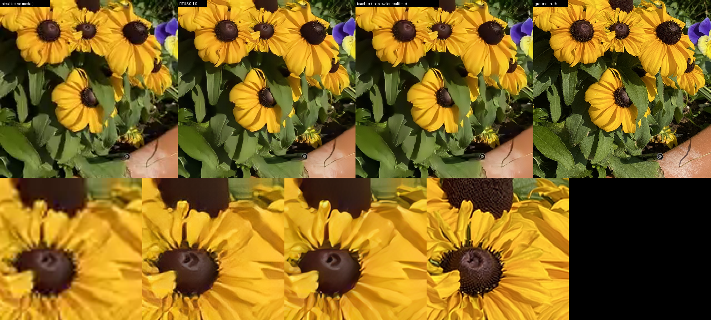
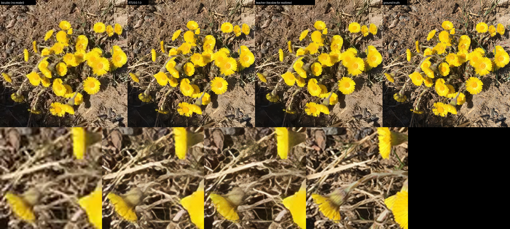
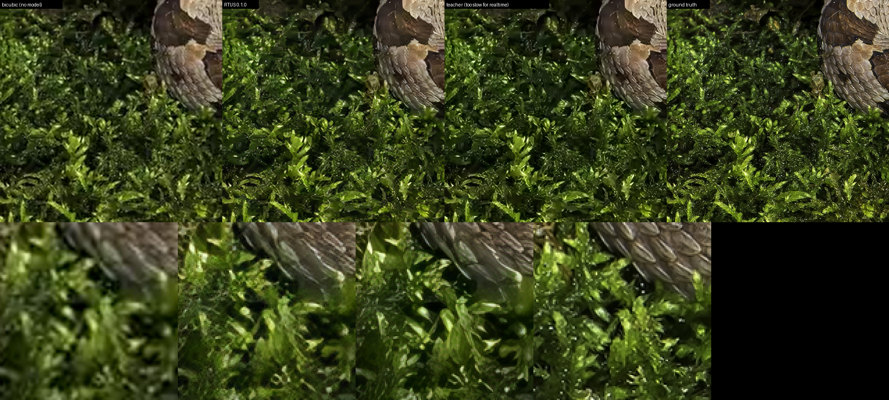
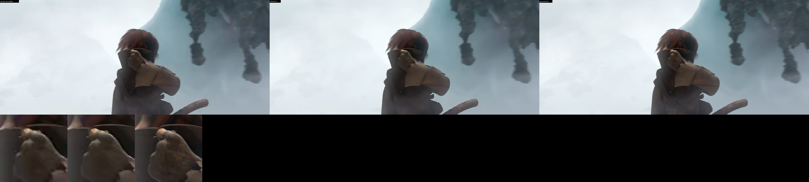
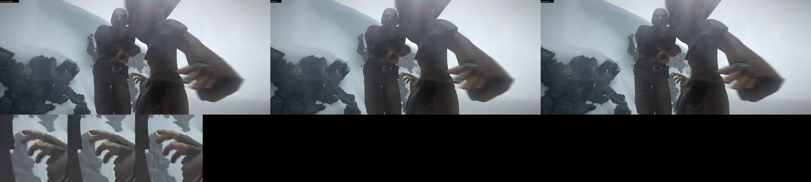

# Model card — userDevice RTUS

This is the card that ships with a weights release. It is kept in the code
repository so it is versioned alongside the model that produced it, and is
uploaded as the `README.md` of the Hugging Face model repository under
[huggingface.co/ltomes](https://huggingface.co/ltomes).

Per-file digests are not reproduced here; they ship as `SHA256SUMS` beside
the weights, generated at upload from the artefacts themselves.

---

## What this is

**RTUS** (Real Time Upscale) is a 2x super-resolution model for video,
trained under a hard per-frame deadline: **38 ms** inside the 41.7 ms of a
24 fps frame, on **NVIDIA Jetson Thor** with TensorRT FP16.

Most super-resolution models optimise a quality metric and never report a
frame time. This one treats the frame budget as the constraint and spends
quality inside it. A quality gain that missed the budget was a rejected
training arm, not a gain.

- **Release** — `0.1.0`, the **stage-D2** checkpoint, iteration 50000,
  selected best-by-DISTS across all eleven D2 checkpoints (0.141940).
- **Tier** — d48, architecture `rtmosr_ea_film`, 9,722,409 parameters.
- **Scale** — 2x.
- **Source code** — https://github.com/ltomes/userdevice-rtus at tag
  [`v0.1.0`](https://github.com/ltomes/userdevice-rtus/releases/tag/v0.1.0).
  A tag rather than a commit hash on purpose: the hash of the commit that
  CONTAINS this card cannot be written into the card, and quoting an earlier
  one dates the moment it is edited. The tag resolves to the exact tree these
  weights were produced from.

A second tier exists in the code (d64, `rtmosr_ea_film_sd`, 33,886,420
parameters, for inputs at or below 720p). **It is not part of this release
and has no published timings.**

## What it looks like

Each validation panel is one frame, four ways: **bicubic** (what you get with
no model at all), **RTUS 0.1.0**, the **teacher** this model was distilled
from, and the **ground truth**. The bottom row is a 3× nearest-neighbour zoom
on the busiest tile in the frame — at full-frame scale on a monitor,
perceptual differences are invisible, which is how a lot of super-resolution
comparisons get away with proving nothing.

These come from the **same validation split every number on this page was
measured on**, so the pictures and the table describe the same data. The
teacher column is the interesting one for a distilled model: it produces
excellent results and **cannot hit the frame budget**, which is the whole
point of the student. Read left to right, the gap between column 2 and column
3 is what distillation cost, and the gap between column 1 and column 2 is what
it bought.

### On real video

The validation split is still frames. Video is not, and a per-frame model
can shimmer on motion while scoring well on every still-frame metric —
which is why the temporal leg exists. These panels are frames from
**Sintel**, degraded the same way, as a check on real footage. They are
**three columns, not four** — bicubic, RTUS and ground truth — because the
teacher was never run over this footage, and a column that did not exist is
not one to invent:

All panels are in [`samples/`](samples).

**Two things about how these were made, because they change what the images
mean.**

The input is degraded with the **same recipe as training** — downscale 1/2,
then real libx264 at CRF 26, decoded back. Not a clean bicubic shrink. Every
super-resolution model looks better on a clean downscale, and it is not the
input this model was built for: the whole point is codec damage. Samples
produced the flattering way would tell you nothing about video.

The video frames are **Sintel**, © copyright Blender Foundation |
[durian.blender.org](https://durian.blender.org), licensed
[CC BY 3.0](https://creativecommons.org/licenses/by/3.0/).

The validation panels are demonstration crops from this project's own
validation split, as every super-resolution model card carries. No dataset
is redistributed here and none is packaged with the model; corpus lineage
is recorded in `PROVENANCE.md`.

## Files in this release

| File | What it is |
|---|---|
| `userdevice-rtus-0.1.0-540p.onnx` | fixed-shape ONNX, 540p input |
| `userdevice-rtus-0.1.0-720p.onnx` | fixed-shape ONNX, 720p input |
| `userdevice-rtus-0.1.0-1080p.onnx` | fixed-shape ONNX, 1080p input |
| `userdevice-rtus-0.1.0-parity.npz` | a fixed real input and the torch fp32 output for it |
| `userdevice-rtus-0.1.0.safetensors` | the training checkpoint, for re-export and fine-tuning |
| `userdevice-rtus-0.1.0-sweep.json` | the sweep this selection was made from |
| `SHA256SUMS` | digests for every file above |

The shapes are fixed rather than dynamic because the deployment target
builds one engine per working point.

**Use the parity file.** It exists so you can confirm your own TensorRT
engine matches the reference implementation instead of trusting that it
does. Run the fixed input through your engine and compare against the
stored fp32 output; the project's own acceptance threshold is **>40 dB**.

## Measured throughput

Measured on the stage-D2 checkpoint — the weights in this release, not a
projection from a different checkpoint.

Jetson Thor, TensorRT 10.13.3, FP16, `builderOptimizationLevel=5`, CUDA
graph enabled, median `enqueueV3` GPU time, compute-only:

| Input | Output | Latency (median) | Throughput |
|---|---|---|---|
| 540p | 1080p | 6.335 ms | 158 fps |
| 720p | 1440p | 12.350 ms | 81 fps |
| 1080p | 4K | 28.742 ms | 35 fps |

p95 and p99 sat within 0.2 ms of the median at every shape. Steadiness is
the point: a model that averages 30 fps but stalls once a second drops
frames. TensorRT parity for this checkpoint was **75.51 dB** against the
torch fp32 reference.

These numbers are compute-only on one named device. They are not a promise
about your pipeline, your hardware, or end-to-end playback.

## How it was trained

A distilled student, trained from scratch with
[traiNNer-redux](https://github.com/the-database/traiNNer-redux). Stage A
initialises from nothing and every later stage initialises from the
project's own stage-A checkpoint, so **no third-party weights are in the
lineage**.

The student is an [RTMoSR](https://github.com/rewaifu/RTMoSR)-style
small-kernel backbone with a per-pixel EA gate on the residual branch of
every backbone block. Ablating the teacher showed its quality lives in EA
gating and collective depth rather than in its 17px large kernels, so the
student keeps the cheap backbone and buys depth over width.

### Training data

No images are redistributed with this model.

- **HR** — the public NomosRealWeb release (6000 × 512² Nomos-v2 HR images).
- **LR** — derived from those HRs: synthesised sub-pixel motion on the HR
  path, downscale 1/2, then real libx264 encoding (CRF 18–34, GOP 24/48),
  harvesting P and B frames. There is no synthetic noise stage — grain is
  signal in the target domain, and only the codec degrades the LR.
- **Distillation targets** — the teacher run over the LR and downscaled 2x.

The `_film` in the architecture and config names denotes the **latency
tier**, not the content. The model was not trained on film or television.

Corpus lineage, recorded as lineage and not as a restriction: the
NomosRealWeb HRs are Nomos-v2, itself distilled from 14 upstream datasets.
Those terms bind the dataset; this release distributes a model and
redistributes no images. Full record in
[`docs/PROVENANCE.md`](https://github.com/ltomes/userdevice-rtus/blob/main/docs/PROVENANCE.md).

## How it was evaluated — and what this release scored

A checkpoint is accepted by passing four legs on identical frames, not
because a number went up. **This release passed all four**, measured
2026-09-05 on the project's validation split:

| Leg | Result for 0.1.0 | Verdict |
|---|---|---|
| Sweep (DISTS) | iter050000 at 0.141940, best of eleven | selected |
| Face gate | 0 violations in 60 images | **PASS** |
| Temporal | 5.9147 vs bicubic 6.0240 (−1.8%) | **PASS** — steadier than bicubic |
| Invention probe | 6.14% vs teacher 8.50% | **PASS** — invents less than the teacher |

Read the invention rate against bicubic rather than as an absolute: bicubic
cannot invent detail, so its 2.14% is the detector's false-positive floor.
The kill condition is exceeding the teacher, and this release sits below it.

The sweep that made the selection ships with the weights as
`userdevice-rtus-0.1.0-sweep.json`, so the choice of iteration 50000 over
the other ten is checkable rather than asserted.

What the four legs are:

1. **Sweep** — PSNR/SSIM/DISTS/LPIPS across every checkpoint against
   bicubic and the teacher, selecting **best-by-DISTS** rather than the last
   iteration.
2. **Face gate** — blocking, zero tolerance. Faces are where invented detail
   is most visible and least forgivable.
3. **Invention probe** — how much high-frequency detail the student invented
   rather than recovered. Inventing more than the teacher (8.50%) kills the
   arm.
4. **Temporal** — flicker across adjacent frames of a clip. A per-frame
   model can shimmer on video while scoring well on every still-frame
   metric.

## Limitations — read before comparing this to anything

- **The quality numbers are not comparable to the super-resolution
  literature.** Every internal figure is computed on the project's own
  validation split. That split is reproducible, but it is not Set5/Set14/
  BSD100/Urban100/Manga109, and it is not Y-channel PSNR. Published
  comparisons against this model are not meaningful until those sets are
  run.
- **Standard SR benchmark sets are out of distribution for this model.**
  They are bicubic-degraded; this model was trained on codec-degraded input,
  which is what video actually is. Expect it to under-perform on them
  relative to models tuned for bicubic degradation, and treat that as a
  domain mismatch rather than a quality verdict.
- **The timings cannot be reproduced from the source repository** — it
  contains no timing harness. They were measured on the target hardware with
  the tooling named above.
- **The d64 tier has no published timings** and is not in this release.
- **Fixed input shapes.** Anything other than 540p, 720p or 1080p input
  needs a re-export from the checkpoint.

## Licence and attribution

**These weights are licensed [CC BY-SA
4.0](https://creativecommons.org/licenses/by-sa/4.0/)** — Creative Commons
Attribution-ShareAlike 4.0 International. You may use, modify and
redistribute them, including commercially, provided you give attribution and
license redistributed derivatives of the weights under the same terms.

The source code is MIT and is licensed separately; see the repository.

**This model is distilled from
[`4xNomosWebPhoto_RealPLKSR`](https://huggingface.co/Phips/4xNomosWebPhoto_RealPLKSR)
by Philip Hofmann**, licensed CC BY 4.0. That attribution is required by the
teacher's licence and travels with these weights. It is not discharged by a
footnote, and it is additional to the CC BY-SA 4.0 terms above.

Third-party components of the code that produced this model: RTMoSR (MIT),
neosr (Apache-2.0), traiNNer-redux (Apache-2.0). Full notices in
[`NOTICE`](https://github.com/ltomes/userdevice-rtus/blob/main/NOTICE).
